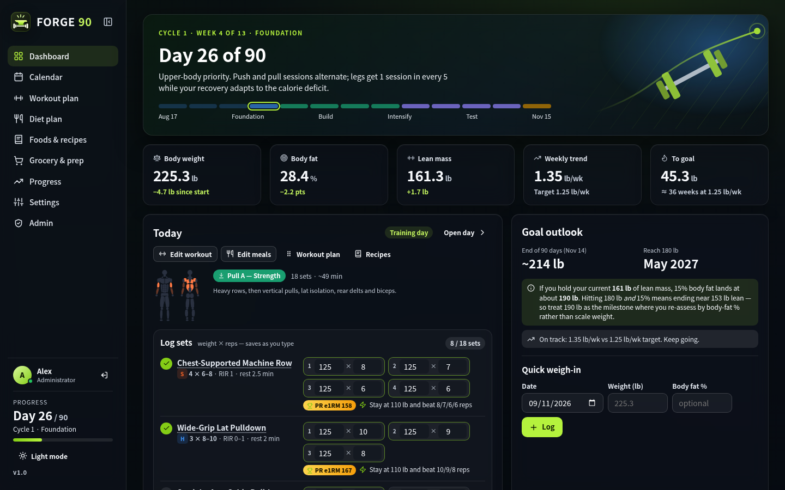
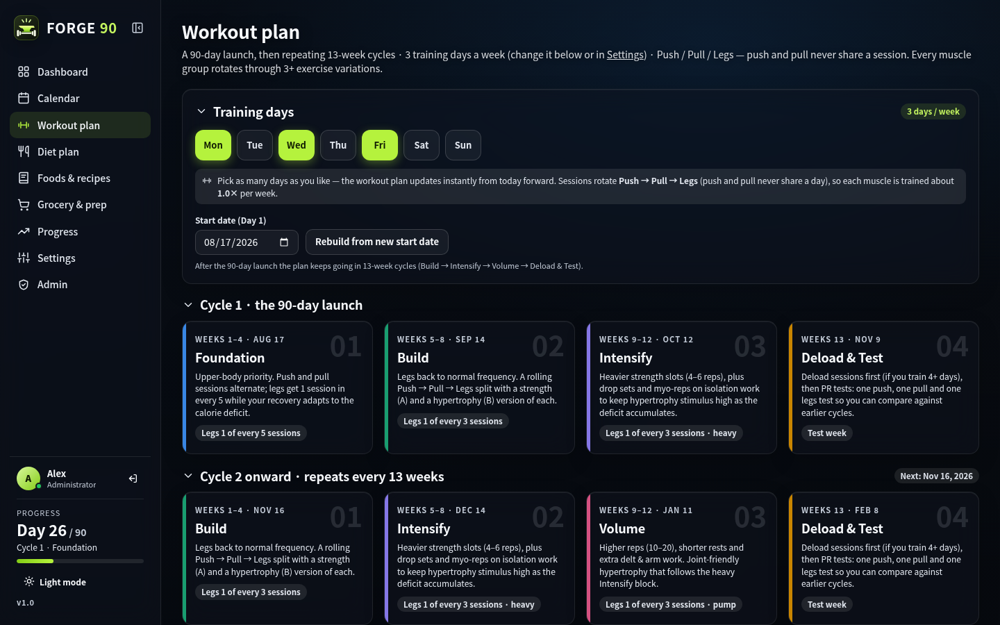
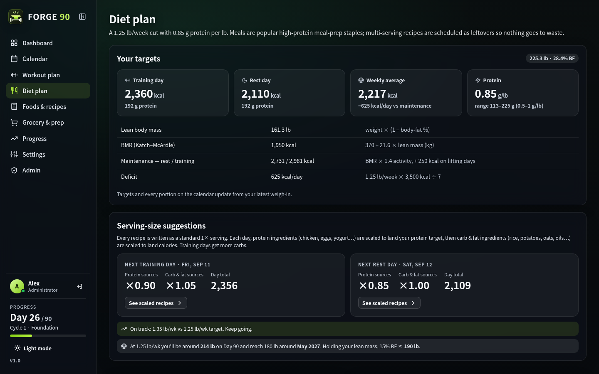
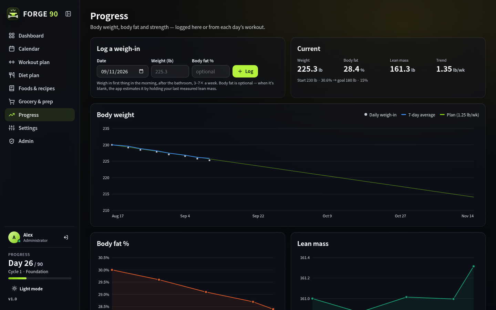
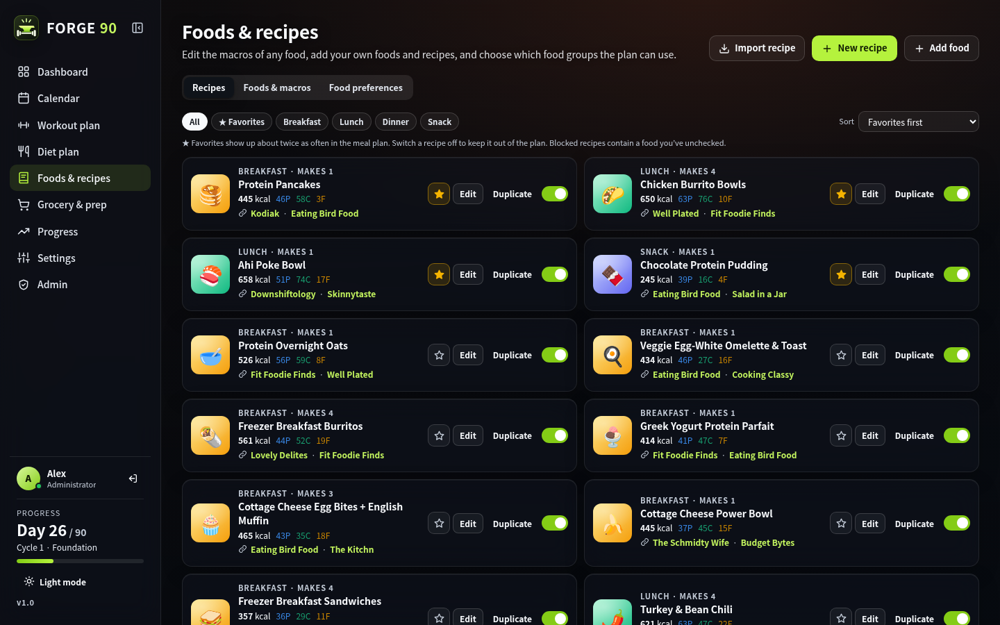
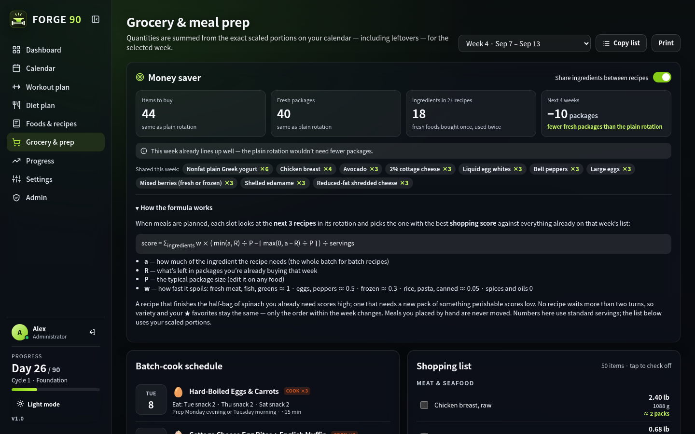
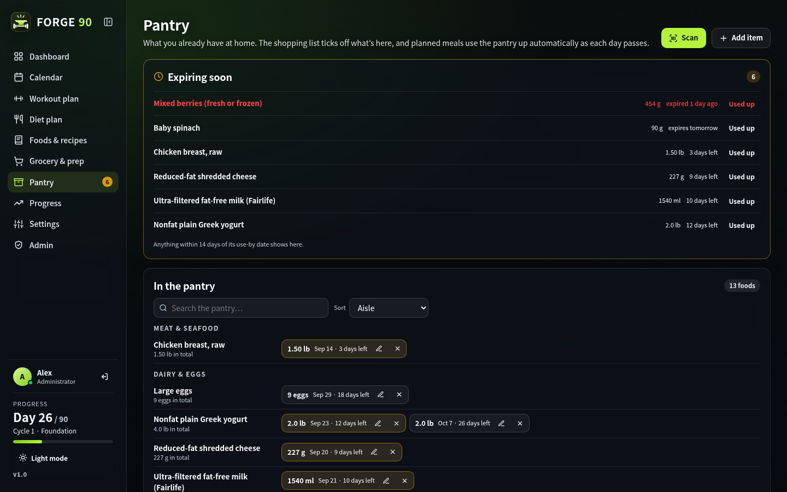
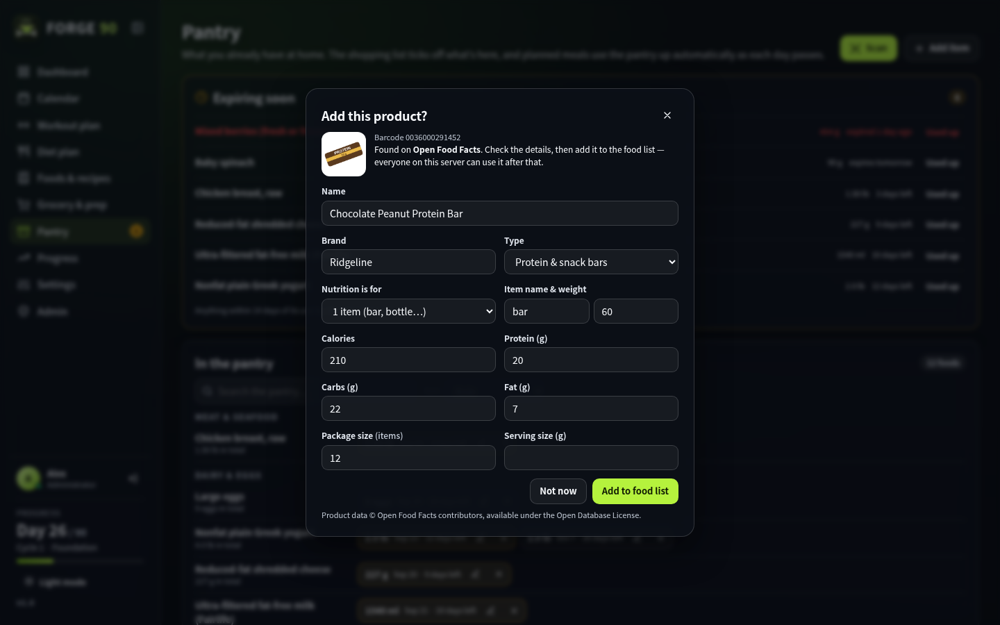
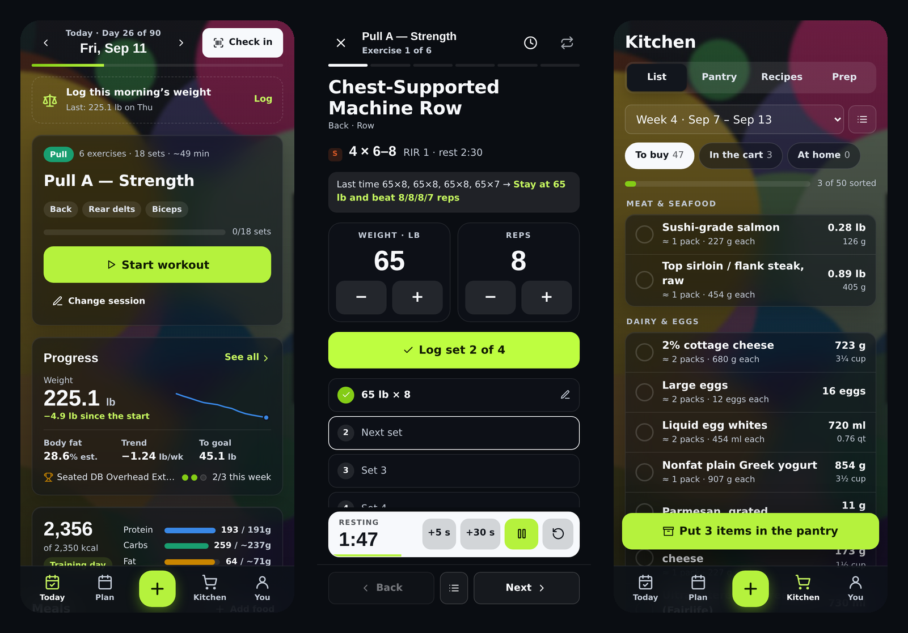

<div align="center">


# FORGE 90

O FORGE 90 é um aplicativo multiusuário e auto-hospedado para musculação e planejamento de refeições, com leitor de código de barras, despensa e receitas integrados, incluindo importação por links da web e pelo [Mealie](https://mealie.io/). Ele monta um programa Push/Pull/Legs de 90 dias que continua em ciclos de 13 semanas, planeja refeições ajustadas aos macros de cada pessoa e acompanha peso, gordura corporal e cargas.



</div>

## Conteúdo

- [Recursos](#recursos)
  - [Treino](#treino)
  - [Registro e calendário](#registro-e-calendário)
  - [Nutrição](#nutrição)
  - [Progresso](#progresso)
  - [Receitas e alimentos](#receitas-e-alimentos)
  - [Compras](#compras)
  - [Despensa](#despensa)
  - [Leitura de código de barras](#leitura-de-código-de-barras)
  - [Importação de receitas](#importação-de-receitas)
  - [Sincronização do plano alimentar](#sincronização-do-plano-alimentar)
  - [Cartões da academia](#cartões-da-academia)
  - [Interface compacta para celular](#interface-compacta-para-celular)
  - [Contas](#contas)
  - [Painel administrativo](#painel-administrativo)
- [Instalação](#instalação)
  - [Configuração](#configuração)
  - [Primeiro acesso](#primeiro-acesso)
- [Backup e recuperação](#backup-e-recuperação)
- [Segurança](#segurança)
- [Licença](#licença)
- [Créditos](#créditos)
- [Aviso](#aviso)

## Recursos

### Treino

- Os primeiros 90 dias passam por quatro fases: Fundação, com mais foco na parte superior do corpo enquanto você se adapta ao déficit, Construção, Intensificação e uma semana de deload com teste de recordes. Depois disso, o plano se repete em ciclos de 13 semanas, e o calendário mantém sempre o ciclo atual e o seguinte programados.
- As sessões alternam Push, Pull e Legs conforme a quantidade de dias de treino escolhida.
- Cada sessão combina séries pesadas de força com trabalho de hipertrofia, usando metas de repetições em reserva (RIR).
- O aplicativo indica quando aumentar a carga para estimular progressão de força.
- Os programas de treino personalizáveis incluem uma biblioteca com mais de 100 exercícios distribuídos em 11 grandes grupos musculares, cada um com execução e dicas. Cerca de metade são alternativas apoiadas por evidências, acompanhadas de uma nota explicando por que foram incluídas. Os exercícios alternam semanalmente dentro de seus padrões de movimento e podem ser ativados ou desativados quando quiser.



### Registro e calendário

As séries podem ser registradas no cartão Hoje do painel, na visão detalhada do dia ou no modo treino. Cada exercício mostra a meta, possíveis recordes e uma sugestão para a próxima vez. O modo treino conduz a sessão um exercício por vez, com sugestão de carga e repetições. O cronômetro de descanso integrado e personalizável pode iniciar automaticamente após o registro de uma série para ajudar a manter um ritmo adequado.

O calendário tem visualizações mensal e semanal, e treinos e refeições podem ser arrastados entre os dias. O painel traz editores rápidos para o treino e as refeições do dia, e **Personalizar** permite reorganizar os painéis ou ocultar os que você não usa.


### Nutrição

Escolha entre três objetivos: perder gordura, manter ou ganhar massa muscular.

As metas calóricas usam a TMB de Katch–McArdle, um multiplicador de atividade e calorias extras nos dias de musculação. A proteína é definida entre 0,5 e 1 g por libra de peso corporal, e carboidratos e gorduras completam o restante. Todos os dias, as porções das receitas são ajustadas para que as refeições atinjam as metas de proteína e calorias, arredondando itens como ovos e tortillas para unidades inteiras. Um orientador de tendência compara a média de peso de 7 dias com a meta e pode ajustar as calorias.

- **Perder gordura** cria um déficit com base no ritmo de perda definido e muda para manutenção quando a meta é atingida.
- **Manter** mantém as calorias estáveis, enquanto o orientador sinaliza desvios em qualquer direção.
- **Ganhar massa muscular** adiciona um superávit calculado a partir de uma meta de ganho semanal como porcentagem do peso corporal. Entre 0,25% e 0,5% é a faixa em que a maioria das pessoas consegue progredir sem transformar boa parte do excedente em gordura. A gordura cai para 25% das calorias, nunca abaixo de 0,3 g por libra, para concentrar o excedente em carboidratos, que sustentam o volume de treino. O superávit é limitado a 500 kcal por dia e a fase de ganho é interrompida, passando para manutenção, quando o limite de gordura corporal é atingido. Ambos os limites podem ser ajustados.



### Progresso

A página Progresso mostra gráficos do peso corporal comparado à média de 7 dias e à linha planejada, além de gordura corporal, massa magra e estimativa de uma repetição máxima para cada exercício, com recordes destacados. É possível visualizar tudo desde o primeiro dia ou apenas as duas últimas semanas e acompanhar quanto peso, gordura corporal e massa magra mudaram nesse período. A página também mostra se a média de 7 dias está à frente ou atrás do plano, quando você alcançará a meta de peso no ritmo atual e quais sessões foram realizadas ou perdidas nas últimas quatro semanas.



### Receitas e alimentos

O FORGE 90 vem com 36 receitas ricas em proteína pensadas para preparo antecipado, cada uma vinculada à fonte original, e uma base com cerca de 650 alimentos. Receitas com várias porções são programadas como sobras. É possível buscar receitas por ingrediente ou tag; as favoritas aparecem com mais frequência no plano; e qualquer receita pode ser editada, desativada, impressa ou criada do zero. As preferências alimentares são organizadas em uma lista por grupo, subgrupo e alimento individual. Desmarcar um alimento remove as receitas que o utilizam e substitui essas refeições futuras.



### Compras

A lista semanal de compras é agrupada por corredor ou grupo de alimentos e soma as porções exatas do calendário, incluindo sobras, com um cronograma de preparo em lote ao lado. Itens já cobertos pela despensa continuam na lista, marcados com um ícone de despensa, para que uma despensa desatualizada não faça você esquecer nada. Se a despensa cobrir apenas parte de um item, a lista mostra a quantidade total e informa quanto já há em casa. **Adicionar marcados à despensa** guarda de uma vez tudo o que foi comprado. Com o planejamento econômico ativado, as refeições de cada semana são organizadas para compartilhar ingredientes frescos, reduzindo embalagens e desperdício sem diminuir variedade nem ignorar favoritos.



### Despensa

A despensa acompanha os alimentos disponíveis em casa, incluindo quantidades e datas de validade. Os itens entram por leitura de código de barras, pela lista de compras ou manualmente, e cada um recebe uma validade típica para aquele tipo de alimento, que pode ser alterada. Itens iguais com a mesma data de validade são mantidos em uma única entrada em vez de gerar várias linhas idênticas, e a busca na despensa mostra primeiro o que vence antes. Conforme cada dia planejado passa, as refeições correspondentes são descontadas automaticamente da despensa, priorizando os itens que vencem primeiro. Tudo que estiver a até duas semanas da validade aparece em **Vencendo em breve**, com uma contagem no item Despensa do menu.



### Leitura de código de barras

No celular, **Escanear** lê o código de barras de alimentos embalados, incluindo EAN-13, UPC-A, EAN-8 e UPC-E, e procura o produto no [Open Food Facts](https://world.openfoodfacts.org). A primeira pessoa a escanear um produto confere nome, informação nutricional e tamanho da embalagem antes da inclusão. Depois disso, qualquer pessoa no servidor pode encontrá-lo por nome, marca ou código de barras. Produtos que não estejam no Open Food Facts podem ser cadastrados a partir do rótulo, e quem adicionou o produto, ou um administrador, pode corrigi-lo depois.

O lugar em que você faz a leitura define o que acontece:

- **Painel, calendário, visão do dia e Alimentos e receitas** (no celular: Hoje e o botão **+**): o produto é adicionado ao dia como alimento extra junto de uma das refeições. Ele entra nos macros do dia e as outras porções são reduzidas para abrir espaço. **Adicionar alimento** faz a mesma coisa sem usar a câmera.
- **Despensa:** cada leitura adiciona uma embalagem diretamente à despensa, permitindo escanear uma sacola inteira de compras em sequência. Escanear novamente o mesmo produto aumenta a quantidade em vez de criar outra linha, e a contagem também pode ser ajustada manualmente. **Revisar** mostra tudo que foi lido naquela sessão, com quantidades e validade, sem precisar abrir a página Despensa para corrigir os dados.

A câmera ao vivo precisa de HTTPS ou `localhost`. Em HTTP comum, Escanear pede uma foto do código de barras. O Chrome no Android usa o leitor de códigos integrado ao celular; outros navegadores, incluindo Safari no iPhone, usam o decodificador do próprio aplicativo.



### Importação de receitas

**Importar receita**, na página Alimentos e receitas, importa uma receita por um link da web ou pelo Mealie usando a API. A importação por link funciona com qualquer site que publique dados padronizados de receita, o que inclui a maioria dos sites desse tipo. Para o Mealie, um administrador informa o endereço do servidor e um token de API em Configurações → Conexões de API. Depois disso, todos podem pesquisar e importar várias receitas de uma vez.

Cada ingrediente é associado a um alimento da base e sua quantidade é convertida para gramas, mililitros ou unidades. Toda importação é aberta para revisão antes de ser salva. O que não puder ser identificado, como um ingrediente sem alimento correspondente, uma quantidade ausente, o tipo de refeição ou o número de porções, fica destacado e precisa ser preenchido. Correspondências incertas também são sinalizadas para conferência. Suas correções são lembradas para a próxima vez. Se uma página não publicar nenhum dado estruturado de receita, o FORGE 90 tenta ler a própria página, procurando um título de ingredientes e a lista abaixo dele. Como isso é uma estimativa, a tela de revisão deixa isso claro e recomenda conferir tudo. Também é sempre possível colar a lista de ingredientes manualmente.


### Sincronização do plano alimentar

A sincronização permite que duas pessoas conectem seus planos alimentares pelas configurações da Conta. Uma envia uma solicitação e escolhe quais refeições compartilhar; a outra aceita. As refeições compartilhadas passam a ser planejadas em conjunto usando apenas receitas que ambas possam consumir, levando em conta os favoritos das duas pessoas. As porções continuam ajustadas às metas individuais, enquanto a lista de compras e o cronograma de preparo em lote passam a considerar ambas.

Quando uma das pessoas altera uma refeição compartilhada, a mudança aparece imediatamente no próprio plano e é enviada à outra pessoa para aceitar ou recusar. Se ela recusar, cada uma mantém sua própria refeição naquele dia. Enquanto a sincronização estiver ativa, um botão Sincronizar nas páginas relevantes mostra quantas alterações aguardam resposta. Qualquer uma das pessoas pode alterar quais refeições são compartilhadas, com aprovação da outra, ou encerrar a sincronização a qualquer momento. Também é possível compartilhar uma única despensa pelas configurações de sincronização: os itens das duas pessoas são reunidos nela, e leituras ou edições atualizam a despensa para ambas. Ao interromper o compartilhamento, cada pessoa mantém uma cópia.


### Cartões da academia

Adicione seu cartão de acesso em Configurações → Cartões da academia ou pelo painel. O código de barras aparecerá no painel para facilitar a entrada. Escaneie o código do cartão ou chaveiro, ou digite o número. São aceitos Code 128, Code 39, Codabar, Interleaved 2 of 5, EAN/UPC e QR codes. O escaneamento identifica o tipo automaticamente. Ao digitar, a opção Automático funciona com a maioria dos leitores, ou você pode selecionar o tipo do seu cartão. Tocar no código de barras abre uma versão em tela cheia e mantém a tela ativa. No celular, **Entrada** no topo da página Hoje faz o mesmo. É possível guardar vários cartões e alternar entre eles. QR codes só podem ser escaneados no Android, onde o navegador oferece um leitor integrado. Navegadores do iPhone não oferecem esse recurso, então o conteúdo do QR code precisa ser inserido manualmente.


### Interface compacta para celular

No celular, o FORGE 90 usa uma interface compacta própria, com cinco abas na parte inferior em vez da barra lateral: Hoje, Plano, +, Cozinha e Você.

- **Hoje** reúne o painel e a visão do dia em uma única página. Faça a entrada na academia, registre a pesagem da manhã, inicie o treino e veja um resumo de progresso que abre a página Progresso completa. As refeições podem ser trocadas por uma lista pesquisável com os favoritos primeiro, e **Personalizar Hoje** define quais painéis aparecem e em que ordem.
- **Plano** reúne calendário, plano de treino e plano alimentar.
- **Cozinha** reúne lista de compras, despensa, receitas e cronograma de preparo. A lista é dividida em Comprar, No carrinho e Em casa. Quando as compras terminarem, um botão coloca todo o carrinho na despensa. Itens cobertos pela despensa aguardam em Em casa, com um botão **Preciso comprar** caso a despensa esteja desatualizada.
- **Você** reúne progresso, recordes, cartões da academia e configurações.
- **+** permite escanear ou adicionar alimentos, registrar peso, mostrar o cartão da academia, adicionar à despensa ou iniciar o treino a partir de qualquer aba.



### Contas

Uma conta é a **proprietária**: a de quem configurou o servidor. Somente o proprietário pode conceder ou remover acesso administrativo, e nenhum administrador pode alterar, desativar ou excluir a conta do proprietário. Assim, ninguém consegue bloquear o proprietário nem esvaziar por acidente a lista de administradores. Administradores também não podem remover o próprio acesso. Em um servidor existente, o administrador mais antigo se torna proprietário na primeira inicialização após a atualização.

Um administrador convida novos usuários em Administrador → Usuários. Cada link de convite funciona uma única vez e expira após 7 dias. Uma senha esquecida pode ser redefinida por e-mail, com link válido por 30 minutos. As contas são bloqueadas após repetidas tentativas de login sem sucesso, e o proprietário recebe por e-mail um link de redefinição. Cada pessoa pode gerenciar perfil, foto, senha e dispositivos conectados, exportar ou importar seus dados e excluir a própria conta.

### Painel administrativo

- **Usuários:** convide pessoas, reenvie ou revogue convites, conceda ou remova acesso administrativo, desbloqueie contas, envie links de redefinição, defina senhas temporárias e exclua contas.
- **Segurança:** regras de senha, bloqueio, duração da sessão e exigência de HTTPS.
- **Configurações do aplicativo:** nome do app, usado em e-mails e na aba do navegador, e endereço usado nos links enviados por e-mail.
- **E-mail:** configurações SMTP, com função de envio de teste.
- **Servidor e proxy:** verifica como a conexão atual chega ao aplicativo, incluindo HTTPS, IP do cliente e cookies seguros, e aponta configurações de proxy que precisam ser alteradas.
- **Registro de atividade** e **Dados e backup:** histórico filtrável de logins e ações administrativas, além de uma exportação JSON completa.


## Instalação

GitHub Container Registry:

```
ghcr.io/oroshi-zz/forge_90:latest
```

A porta padrão é `8090`. Um template do Unraid está incluído em `unraid/forge90.xml`.

### Configuração

| Variável | Padrão | Descrição |
|---|---|---|
| `APP_URL` | host da solicitação | Endereço público usado em convites, links de redefinição e como destino do redirecionamento de HTTPS obrigatório. |
| `PORT` | `8090` | Porta de escuta dentro do contêiner. |
| `DATA_DIR` | `/app/data` | Local dos dados. |
| `ADMIN_EMAIL` | `admin@forge90.local` | Administrador padrão, criado na primeira inicialização. |
| `ADMIN_PASSWORD` | `forge90-admin` | Senha padrão do administrador. Deve ser alterada no primeiro acesso. |
| `SMTP_HOST` | `smtp.gmail.com` | Servidor de e-mail. |
| `SMTP_PORT` | `465` | Porta do servidor de e-mail. |
| `SMTP_SECURITY` | `tls` | `tls`, `starttls` ou `none`. |
| `SMTP_USER` | | Usuário da conta de e-mail. |
| `SMTP_PASS` | | Senha da conta de e-mail. |
| `MAIL_FROM` | `SMTP_USER` | Endereço do remetente. |
| `MAIL_FROM_NAME` | `FORGE 90` | Nome do remetente. |
| `TRUST_PROXY` | desativado | Endereços do proxy reverso, em IPs ou faixas CIDR separadas por vírgula, ou `true` para confiar em qualquer origem. Cabeçalhos encaminhados de outros locais são ignorados. |
| `IMPORT_ALLOW_PRIVATE` | `false` | Permite que a importação por link acesse endereços da rede privada, útil para sites de receitas hospedados na sua própria rede. |
| `OFF_URL` | `https://world.openfoodfacts.org` | Destino das consultas de código de barras caso você use um espelho do Open Food Facts. |
| `REQUIRE_HTTPS` | auto | Quando `APP_URL` usa HTTPS, solicitações HTTP comuns em qualquer outro host são redirecionadas para ele e o cabeçalho HSTS é enviado. Defina como `false` para desativar. |
| `COOKIE_SECURE` | `auto` | Marca o cookie de sessão como Secure quando a solicitação usa HTTPS. |
| `TZ` | `UTC` | Fuso horário usado nos e-mails. |

As configurações de e-mail também podem ser alteradas em Administrador → E-mail.

> [!IMPORTANT]
> Configurar SMTP é obrigatório para enviar convites e redefinições de senha. É recomendável manter o SMTP configurado mesmo com apenas um usuário, para permitir recuperação em caso de bloqueio acidental.

### Primeiro acesso

Entre com `admin@forge90.local` / `forge90-admin` ou com seus valores de `ADMIN_EMAIL` / `ADMIN_PASSWORD`. Você deverá definir uma nova senha e um endereço de e-mail real e depois passará pelo questionário inicial. Em seguida, convide usuários em Administrador → Usuários.

## Backup e recuperação

Tudo fica armazenado na pasta de dados:

- `db.json`: contas, sessões, convites, configurações e registro de atividade
- `state/`: plano de cada usuário
- `avatars/`: fotos de perfil
- `foods.json`: produtos adicionados por leitura de código de barras e compartilhados por todos
- `sync/`: dados de refeições compartilhadas entre usuários sincronizados

Para fazer backup, copie a pasta com o contêiner parado. Administrador → Dados e backup também permite baixar uma exportação JSON de todas as contas e planos, mas sem os hashes de senha; por isso, serve como registro, não como restauração completa. Usuários individuais podem exportar e importar o próprio plano nas configurações da Conta.

Se você perder o acesso à única conta administrativa, pare o contêiner e execute temporariamente uma cópia da imagem apontando para a mesma pasta de dados:

```bash
docker run --rm -v /path/to/data:/app/data ghcr.io/oroshi-zz/forge_90:latest \
  node server.js --set-password you@example.com "new-password"

# ou promova uma conta existente
docker run --rm -v /path/to/data:/app/data ghcr.io/oroshi-zz/forge_90:latest \
  node server.js --make-admin you@example.com

# ou transfira a propriedade para outra conta
docker run --rm -v /path/to/data:/app/data ghcr.io/oroshi-zz/forge_90:latest \
  node server.js --make-owner you@example.com
```

## Segurança

- As senhas são protegidas com hash scrypt. Tokens de sessão, convite e redefinição são valores aleatórios de 256 bits armazenados apenas como hashes.
- Solicitações entre sites são bloqueadas, e as respostas usam uma Content Security Policy restrita.
- Endpoints de login, redefinição e convite têm limite de requisições por IP, e contas são bloqueadas após falhas repetidas. O formulário de senha esquecida fornece a mesma resposta independentemente de a conta existir.
- Atrás de um proxy, o IP do cliente é obtido da entrada adicionada pelo proxy em `X-Forwarded-For`, impedindo que alguém contorne os limites de requisição enviando o próprio cabeçalho.
- Usuários sincronizados veem apenas as refeições e porções compartilhadas entre si.
- Fotos de perfil são recortadas e recodificadas no navegador, verificadas no servidor e exibidas somente para usuários conectados. Enviar uma nova foto exclui o arquivo anterior.
- A importação por link acessa apenas endereços públicos, evitando que seja usada para sondar sua rede. O token do Mealie permanece no servidor e nunca é enviado ao navegador.
- Números de cartões da academia são salvos junto ao plano do usuário e não são compartilhados com parceiros de sincronização.
- Códigos de barras são decodificados no celular e as imagens da câmera nunca saem do aparelho. As consultas passam pelo servidor, portanto o Open Food Facts recebe apenas o número do código.

## Licença

O FORGE 90 é licenciado sob a GNU Affero General Public License v3.0 ou posterior. Consulte [LICENSE](LICENSE). Se você disponibilizar uma versão modificada para outras pessoas, a AGPL exige que o código-fonte dessa versão seja oferecido a elas; altere `SOURCE_URL` em `src/ui-core.js` para apontar para a sua cópia.

## Créditos

As fotos de fundo são do Unsplash: Victor Freitas, Jorge Alberto Vega Barrera, Mina Rad, Shan A. Rajpoot, Rodrigo Rodrigues, Jason Briscoe, Vitaly Gariev, Jakob Owens, Alina Rubo e Jonathan Borba, responsável pela foto da tela de login. Os valores dos alimentos são aproximações baseadas no USDA FoodData Central. Os dados de produtos identificados por código de barras vêm dos colaboradores do Open Food Facts sob a Open Database License. Os links das receitas apontam para seus autores originais.

## Aviso

Nada no FORGE 90 constitui orientação médica. Consulte um profissional de saúde antes de seguir recomendações de exercício ou nutrição.
